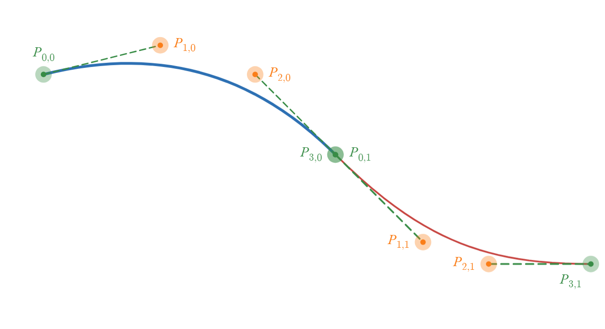

# bezier_interpolation

`bezier_interpolation` is a Python library for generating smooth curves between given points using cubic Bezier or quadratic interpolation.   

It solves a specific problem: Calculate the optimal control points between two data points to have smooth bezier curves.   

It provides a simple and efficient way to calculate the control points and interpolate the data, making it ideal for applications in computer graphics, data visualization, and other fields where smooth curves are required.


## Installation instructions

```sh
pip install bezier_interpolation
```

## Math explanation: 

### Cubic segments:
Let's say we have this 3 green points $P_{0,0}$, $P_{3,0} = P_{0,1}$ and $P_{3,1}$ and we want to have a smooth curve between them.   


We need to find where to set the control points $P_{1,0}$, $P_{2,0}$, $P_{1,1}$ and $P_{2,1}$.   

Here the first index represent the point and the second represent the segment.   
In general we have n points, n - 1 segments, and we need to find $P_{1,i}$ and $P_{2,i}$ control points for i $\in [0, n - 1]$   

For that we need to set two conditions:   
1. The last point in one segment $P_{3,i}$ is equal to the start point in the next segment $P_{0, i + 1}$. 
2. To get a smooth curve we need to make sure the slope of the line connecting $P_{2,0}$ and $P_{3,0}$ is the same as $P_{3,0}$ and $P_{0,1}$.    


We can write the first condition as 
$$
\begin{align}
P_{0,i} = P_{3,i - 1} = K_i
\end{align}
$$

For the second condition we are goint to use derivatives. The first derivative of any polynomial curve is the slope, so let's derivate the equation for a cubic Bezier curve:  

$$
\begin{align}
B(t) = (1 - t)^3 \cdot P_0 + 3(1 - t)^2t \cdot P_1 + 3(1 - t)t^2 \cdot P_2 + t^3 \cdot P_3
\end{align}
$$

Ant its first derivative:

$$
\begin{align}
B'(t) = 3(1 - t)^2 \cdot (P_1 - P_0) + 6(1 - t)t \cdot (P_2 - P_1) + 3t^2 \cdot (P_3 - P_2)
\end{align}
$$

By definition, if we replace $t = 0$ in $B(t)$ we get $B(0) = P_0$ and $B(1) = P_3$, so, to meet our condition we can write $$B'_i(0) = B'_{i-1}(1)$$    

If we replace the values in the equation, we get: 

$$-3P_{0,i} + 3P_{1, i} = -3 P_{2,i-1} + 3 P_{3, i-1}$$   

And using the eq (1):
$$
\begin{align}
2K_i = P_{1,i} + P_{2, i-1}
\end{align}
$$   

We will now move to the second derivative. The second derivative tells us about the continuity of the curve. The second derivative of the bezier curve is:

$$
\begin{align}
B''(t) = 6(1 - t) \cdot (P_2 - 2P_1 + P_0) + 6t \cdot (P_3 - 2P_2 + P_1)
\end{align}
$$

The second derivative talks about the continuity and concavity of the plot.   
So, we can write: 
$$B''_i(0) = B''_{i-1}(1)$$

If we substitute again we get:
$$ -2P_{1,i} + P_{2,i} = P_{1, i - 1} - 2P_{2, i - 1} $$

Those equations only apply in the internal knots, when the segments come together. So, let's get the equations for the boundaries, this is, $i = 0$ and $i = n - 1$:

$$B''_i(0) = 6P_{0,0} - 12 P_{1,0} + 6P_{2,0}  $$

$$ K_0 - 2P_{1,0} + P_{2,0} = 0  $$

and:

$$ P_{1,n-1} - P_{2,n-1} + K_n= 0  $$

now we have:

$$ 2P_{1,0} + P_{1,1} = K_0 + 2K_1 $$
$$ P_{1,i-1} + 4P_{1,i} + P_{1, i+1} = 4K_i + 2K_{i+1} $$
$$ 2P_{1,n-2} + P_{1,n-1} = 8K_{n-1} + K_n $$

With those equations we can set a matrix system with the form Ax -b = 0, when A is a tri-diagonal matrix with this form:

$$
\begin{bmatrix}
2 & 1 & 0 & 0 & \cdots & 0 \\
1 & 4 & 1 & 0 & \cdots & 0 \\
0 & 1 & 4 & 1 & \cdots & 0 \\
\vdots & \vdots & \ddots & \ddots & \ddots & \vdots \\
0 & 0 & \cdots & 1 & 4 & 1 \\
0 & 0 & \cdots & 0 & 2 & 7
\end{bmatrix}
$$